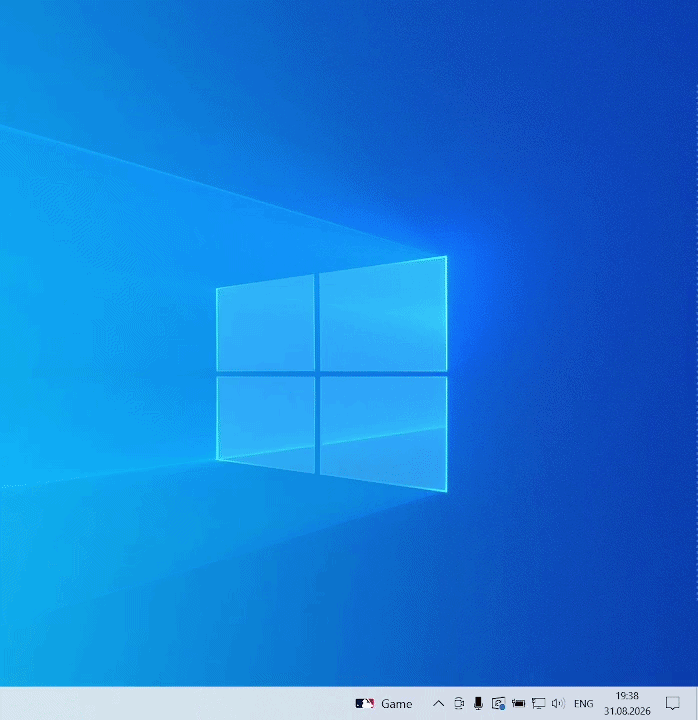
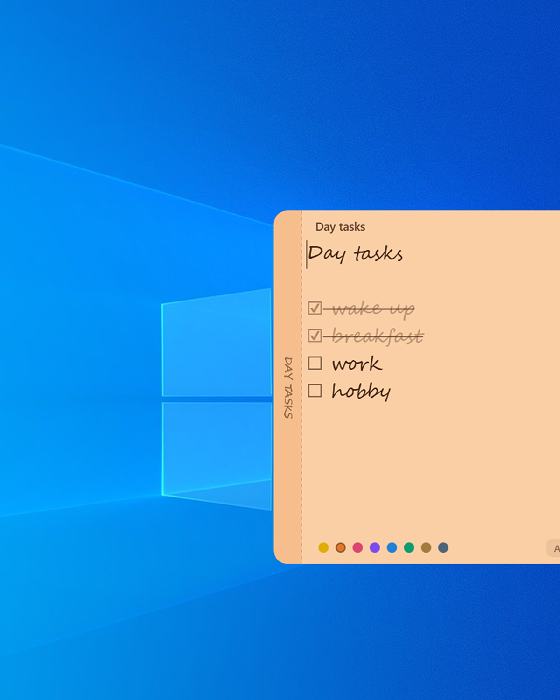
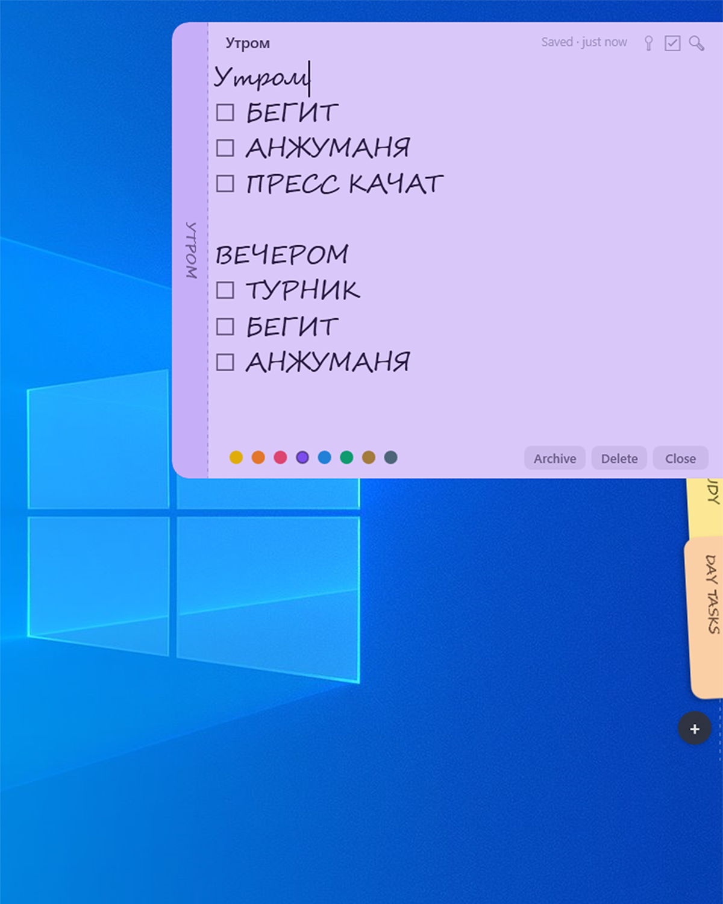
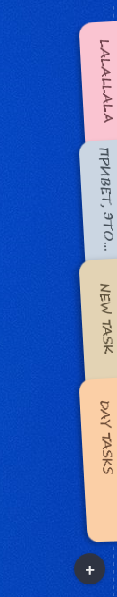

# Noty for Windows

Sticky notes that live at the edge of your screen.

A Windows port of [aimen08/noty](https://github.com/aimen08/noty), built with
.NET 8 and WPF.

No taskbar button, no window to manage. Move the pointer to the screen edge and
the deck fans out.

## Install

Download the [latest release](https://github.com/mole88/noty-windows/releases/latest)
and run `Noty-Setup-*.exe`.

## Demo



### Open notes

| Tasks and colours | Notes in the deck |
|---|---|
|  |  |

### Deck states

| Idle | Labelled tabs | Colour chips |
|:---:|:---:|:---:|
|  |  |  |

## Features

- A compact edge deck with labelled tabs or colour chips
- Plain-text notes with live Markdown styling
- Checkbox tasks, search, pinning, colours and word-based undo
- Autosave, archive and a searchable All Notes window
- Drag-to-reorder and multi-monitor support
- Configurable fonts, deck position and keyboard shortcuts
- Markdown, text and `.stickies` import/export
- Local encrypted storage with no account or telemetry

## Shortcuts

Global shortcuts:

| Shortcut | Action |
|---|---|
| `Ctrl+Alt+N` | New note |
| `Ctrl+Alt+A` | All Notes |
| `Ctrl+Alt+L` | Archive |

Inside a note:

| Shortcut | Action |
|---|---|
| `Esc` | Close the note |
| `Ctrl+F` | Find |
| `Ctrl+T` | Toggle a task |
| `Ctrl+P` | Pin |
| `Ctrl+.` | Cycle colour |
| `Ctrl+Shift+A` | Archive |
| `Ctrl+Shift+Backspace` | Delete, with ten seconds to undo |
| `Ctrl++` / `Ctrl+-` | Change text size |

Shortcuts can be changed in Settings.

## Privacy

Notes are stored locally in `%APPDATA%\Noty`. Note bodies are encrypted with
AES-GCM, and the key is protected with Windows DPAPI.

Noty has no account, server, analytics or network access.

## Build

Requires the .NET 8 SDK or newer.

```powershell
.\build.ps1 release run
```

To create a self-contained executable:

```powershell
.\build.ps1 publish
```

The result is written to `publish\` together with the license.

To run the automated test suite:

```powershell
dotnet test .\Noty.slnx -c Release
```

To build a Windows installer with Inno Setup 6 or 7:

```powershell
.\build.ps1 installer
```

The installer is written to `dist\Noty-Setup-1.0.0.exe`.

## License

MIT, like the original project. See [LICENSE](LICENSE).
